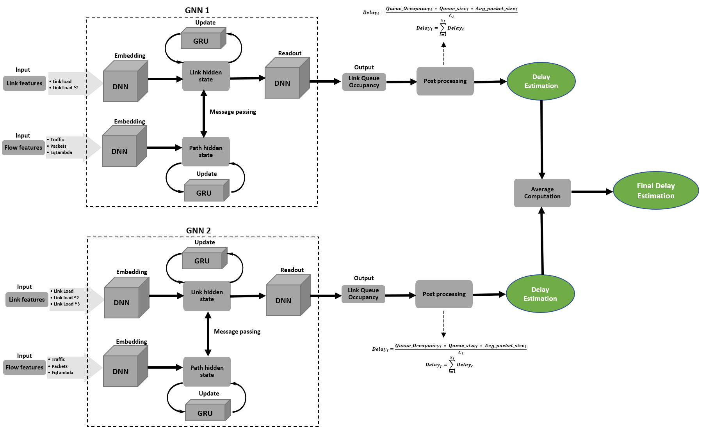

# ITU-ML5G-PS-001-SOFGNN-Graph-Neural-Networking-Challenge
This repository contains the code and description of our solution as well as the report and the final presentation slide.

## Requirements
Our implementation is based on the tensorflow version of [RouteNet model](https://github.com/BNN-UPC/GNNetworkingChallenge/tree/2021_Routenet_TF). The main librairies
used are:

• numpy==1.19.5

• pandas==1.3.2

• tensorflow==2.4.2

• networkx==2.5.1

All of them can be installed with pip install. The python version is Python 3.8.8.

## Proposed Solution
Our solution is made of the combination of two independent models. For the training, both models is trained separately (sequentially or in parallel). Here is its architecture.

# Credits
This project is the result of collaboration between:

Brigitte Jaumard - Computer Science and Software Engineering Dpt,Concordia University, Montreal (Qc) Canada

Charles Boudreau - Computer Science and Software Engineering Dpt,Concordia University, Montreal (Qc) Canada

Junior Momo Ziazet - Computer Science and Software Engineering Dpt,Concordia University, Montreal (Qc) Canada

Huy Duong - Centre de Recherche Informatique de Montréal (CRIM), Montreal (Qc) Canada
